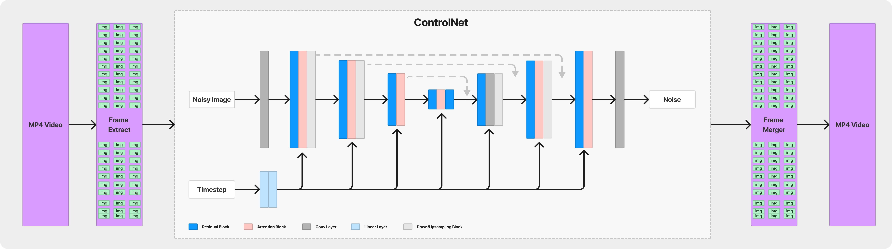

# CNET-Motion
CNET-Motion is a repository for applying ControlNet to video frames, providing motion-based image transformations. This project uses the diffuser library for stable diffusion-based image-to-image transformation.

## Overview
The goal of this project is to demonstrate the application of ControlNet from the diffuser library to video frames. It takes video frames as input, applies ControlNet transformations, and produces motion-based image outputs.

[](https://youtube.com/shorts/Kboe-q3fu2Q)

## Getting Started

[](https://colab.research.google.com/drive/15vTIUNMB2ShxN2APsdfcSUwOhtOpDm_j?usp=sharing)

### Prerequisites

- Python 3.6 or higher
- Install dependencies by running: `pip install opencv-python transformers accelerate`

### Usage

1. Clone the repository:
   ```bash
   git clone https://github.com/your-username/CNET-Motion.git
   cd CNET-Motion

2. Install required Python packages:
   ```bash
   pip install -r requirements.txt

3. Run the main script:
   ```bash
   python main.py

### Konfigurasi
- ControlNet model: The ControlNet model used in this project is loaded from `lllyasviel/sd-controlnet-canny`. You can explore other pre-trained models or fine-tune the model based on your requirements.
- Stable Diffusion model: The Stable Diffusion model used is loaded from `runwayml/stable-diffusion-v1-5`. Adjust the model parameters and settings in process_video.py as needed.

## How does this work?


### Model Initialization:
- The ControlNet model and Stable Diffusion model are initialized using pre-trained weights.

### Frame-to-Frame Process:
- Each frame of the video is processed separately.
- Input frames are processed via Canny edge detection and then prepared as input for ControlNet.
- ControlNet is applied to each frame to produce a modified output frame.

### Frame Merging:
- The changed frames from each iteration are combined into a new video.

### Configuration Explanation:
- Users can configure the ControlNet model and Stable Diffusion model by setting appropriate parameters and options.

### User Instructions:
 - A guide to using this project is included in README.md, including steps for installation and execution.


## Contribution
Please contribute by opening an issue or submitting a pull request. We really appreciate your contribution!
This project is still under development, so please help.

## License
This project is licensed under the MIT License - see the LICENSE file for details.

## Acknowledgments
This project is built upon the diffuser library. Check out their repository for more details on stable diffusion-based image transformations.
